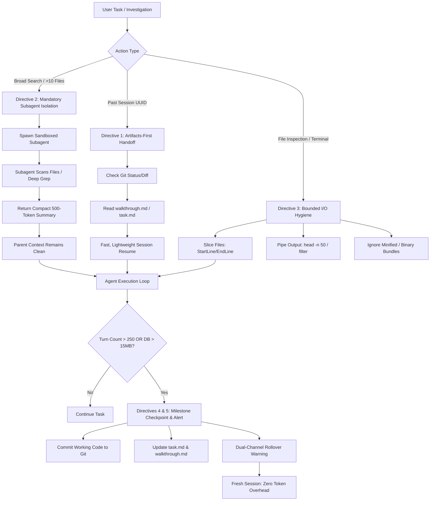

# Agent Context Optimization Directives ⚡

[](LICENSE)
[](rules/context_management.md)
[](rules/cursor_rules.md)
[](rules/claude_code.md)
[](CONTRIBUTING.md)

> **Architectural directives to eliminate context bloat, isolate subagent blast radiuses, and automate session handoffs in autonomous AI coding agents.**

---

## 🎯 The Problem: Context Compounding

As autonomous AI coding agents (such as Google Antigravity, Claude Code, Cursor, and custom agent harnesses) execute complex tasks, conversation history compounds over dozens of turns:

1. **Quadratic Latency**: Every subsequent prompt re-transmits hundreds of thousands of historical tokens to the API.
2. **Attention Dilution ("Lost in the Middle")**: Massive context windows cause reasoning degradation, hallucinated diffs, and forgotten instructions.
3. **Telemetry & Storage Bloat**: Local databases and raw JSONL logs balloon to hundreds of megabytes, degrading local IDE responsiveness.

```
Without Directives (Context Explosion):
Turn 01: [System Prompt + User Prompt]               ~ 2k tokens
Turn 10: [History + 15 Unbounded File Reads]         ~ 80k tokens
Turn 35: [History + Verbose Logs + Bundles]         ~ 210k tokens
Turn 60: [Critical Latency & Attention Breakdown]    ~ 450k+ tokens
```

---

## 💡 The Solution: 5 Core Directives

This repository codifies **5 battle-tested directives** that keep agents fast, cost-effective, and laser-focused.



---

## 📋 Directives Breakdown

### 1. Past Session Investigation & Handoff (Artifacts First)
- **Rule**: Never load full raw trajectory logs (`transcript.jsonl` or `transcript_full.jsonl`) into context.
- **Workflow**:
  1. Inspect `git status` and `git log -n 5` first (the repository state reflects the true state of past code).
  2. Read structured summary artifacts from the session folder: `walkthrough.md`, `task.md`, and `implementation_plan.md` (< 15 KB).
  3. Grep bounded line ranges only if specific stack traces are missing.

### 2. Search Scope Assessment & Mandatory Subagent Isolation
- **Index-First Principle**: If a knowledge graph exists (e.g. `graphify-out/`), query it first via CLI/MCP (`graphify query`, `graphify path`). A targeted subgraph query frequently answers questions in < 20 lines without touching source files.
- **Threshold**: When an operation requires touching **> 8–10 files**, scanning raw trees, or processing unindexed documents, the parent agent **must delegate** the work to an isolated subagent sandbox.
- **Handoff Requirement**: The subagent processes thousands of tokens in its isolated sandbox and returns **only a compact, synthesized summary** to the parent agent.

### 3. Bounded File Reading & Output Hygiene
- **Selective Slicing**: Files exceeding 200 lines are read using bounded slice windows (`StartLine`/`EndLine`).
- **Piped Terminal Outputs**: Unbounded terminal commands must use truncation (`head -n 50`, `Select-Object -First 30`, `git log -n 5`).
- **No Bundle or Raw Graph Dumps**: Never load minified assets (`*.min.js`), lockfiles, raw binary files, or raw graph database dumps (e.g. calling `view_file` on `graphify-out/graph.json`) into conversation history.

### 4. Milestone Checkpointing (The 250–300 Step Rule)
- Long multi-turn conversations naturally compound latency.
- Upon approaching 250–300 steps or completing a key milestone:
  1. Commit working code to git.
  2. Keep persistent indexes synchronized (e.g. `graphify update .` to refresh AST state with zero token cost).
  3. Update `walkthrough.md` and `task.md`.
  4. Suggest rolling over to a fresh session to continue from git and `task.md` with zero token overhead.

### 5. Proactive Dual-Channel Rollover Alerts
When conversation database sizes (> 15 MB) or step counts (> 250) cross thresholds, the agent delivers an immediate **two-channel warning**:
- **Channel A (In-Chat Warning)**: Prominent GitHub-style warning block alerting the user of compounding re-transmission latency.
- **Channel B (Walkthrough Banner)**: Header banner in `walkthrough.md` preparing a seamless handoff to the next session.

---

## 🚀 Quickstart & Installation

### Option 1: Google Antigravity (AGY)

#### Global Installation (Recommended)
Copy the canonical rule file to your global Antigravity rules directory:
```bash
# Windows
cp rules/context_management.md C:\Users\<YourUser>\.gemini\config\rules\context_management.md

# macOS / Linux
cp rules/context_management.md ~/.gemini/config/rules/context_management.md
```

#### Project-Level Installation
Place the rule in your repository's `.agents/rules/` directory:
```bash
mkdir -p .agents/rules
cp rules/context_management.md .agents/rules/context_management.md
```

---

### Option 2: Cursor & Windsurf

Add the contents of [`rules/cursor_rules.md`](rules/cursor_rules.md) to your workspace's `.cursorrules` file or project system prompt:
```bash
cat rules/cursor_rules.md >> .cursorrules
```

---

### Option 3: Claude Code

Add the contents of [`rules/claude_code.md`](rules/claude_code.md) to your project's `CLAUDE.md`:
```bash
cat rules/claude_code.md >> CLAUDE.md
```

---

## 📚 Deep Dive Documentation

- **[Integrations & Synergy: The Two-Tier Context Architecture](docs/INTEGRATIONS.md)**: How these directives harmonize seamlessly with **Graphify**, GraphRAG, and AST indexers to create a complete static + dynamic context solution.
- **[Architecture & Theory](docs/ARCHITECTURE.md)**: Mathematical and architectural breakdown of context compounding, KV-cache re-ingestion, and subagent state boundaries.
- **[Before & After Examples](docs/EXAMPLES.md)**: Real-world engineering scenarios comparing unconstrained vs optimized agent runs.

---

## 🤝 Contributing

Contributions, adaptations for other agent frameworks, and refinements to threshold metrics are welcome! Please check out [CONTRIBUTING.md](CONTRIBUTING.md) to get started.

---

## 📄 License

Distributed under the [MIT License](LICENSE). Built by [Amin Fallah](https://github.com/AminFallah4252).
