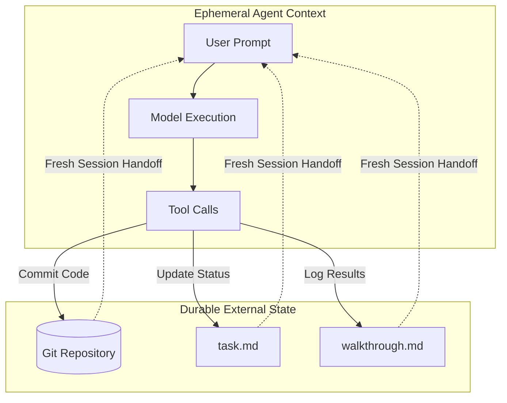
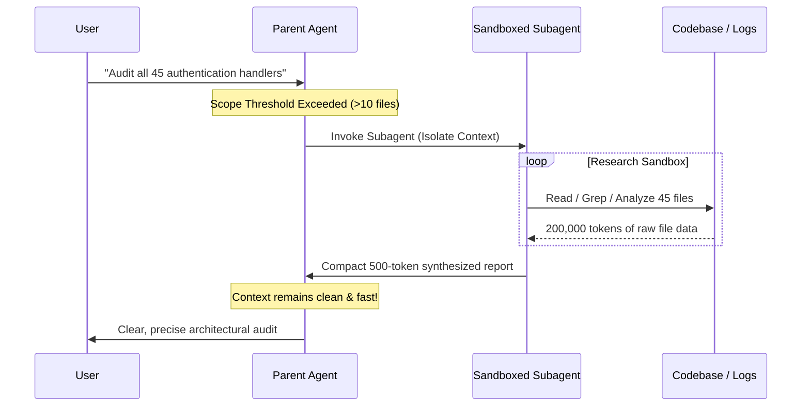

# Architecture & Theory: Agent Context Optimization

Autonomous AI coding agents operate in multi-turn loops. Understanding the computational, economic, and behavioral dynamics of conversation history is critical for building resilient agent workflows.

---

## The Context Compounding Problem

In standard agent architectures, every interaction turn appends to the conversation history:

$$\text{Total Tokens Transmitted} = \sum_{i=1}^{N} (\text{Context}_{i-1} + \text{ToolOutputs}_i + \text{Response}_i)$$

As turn count $N$ scales:
1. **Quadratic Network & Ingestion Overhead**: The API re-ingests the entire history on every request. Even with prompt caching, multi-megabyte payloads degrade network round-trip time and inflate memory pressure.
2. **"Lost in the Middle" Phenomenon**: LLM attention weights dilute as token lengths approach hundreds of thousands of tokens, increasing the probability of instruction drift, hallucinations, and ignored system instructions.
3. **Compounding Telemetry Bloat**: Local databases (`conversations/<uuid>.db`) and trajectory logs (`transcript.jsonl`) grow into hundreds of megabytes, slowing down IDE tooling and local search.

```
Without Optimization (Context Explosion):
Turn 1:  [System Prompt] + [User Request]                           ~ 2k tokens
Turn 10: [History] + [10 Full File Reads]                          ~ 65k tokens
Turn 30: [History] + [Logs Dump] + [Build Artifacts]              ~ 180k tokens
Turn 50: [Critical Bloat] -> High Latency, Timeouts, Hallucinations
```

---

## Core Architectural Solutions

### 1. Artifacts as External State (Persistent External Memory)
Instead of treating the conversation history as the sole source of truth, these directives decouple **ephemeral working memory** from **persistent project state**:

- **Code & Version Control (`git`)**: The primary source of truth for code changes.
- **Structured Artifacts (`walkthrough.md`, `task.md`, `implementation_plan.md`)**: Human- and machine-readable summaries (< 15 KB) capturing architectural intent and open tasks.
- **Conversation Context**: Treated as transient scratchpad memory that can be safely reset at any milestone.



---

### 2. Subagent Sandboxing (Blast Radius Isolation)
When an agent must inspect numerous files or unstructured logs, running those operations in the root context pollutes the parent conversation permanently.

By enforcing subagent delegation:
- The subagent runs inside an isolated execution sandbox.
- It can read dozens of files, test commands, and query tools.
- **Crucial Rule**: The subagent only transmits a **compact, distilled summary** back to the parent agent.
- Result: The parent context retains only high-signal findings, preserving speed and token efficiency.



---

### 3. Bounded I/O & Output Hygiene
Large files and uncontrolled terminal output are the most common source of sudden context spikes.
- **Slice Reading**: Inspecting bounded line ranges (`StartLine`/`EndLine`) targets relevant symbols without loading irrelevant boilerplate.
- **Command Output Piping**: Restricting terminal outputs (`head -n 50`, `Select-Object -First 30`) prevents multi-thousand-line stack traces from overwhelming the model.
- **Asset Filtering**: Excluding minified bundles (`bundle.min.js`), lockfiles (`package-lock.json`), and binaries.

---

### 4. Milestone Rollovers & Proactive Alerting
Conversations that pass 250–300 steps inevitably suffer performance degradation.
Rather than allowing an agent to fail silently or stall out:
1. The agent monitors trajectory metrics (file sizes of logs and step numbers).
2. It triggers a **Dual-Channel Alert**:
   - In-Chat alert block recommending a fresh session.
   - Banner notification inside the updated `walkthrough.md` checkpoint.
3. The developer or automated orchestrator spins up a new session with **zero token overhead**, reading directly from `task.md` and git commits.
