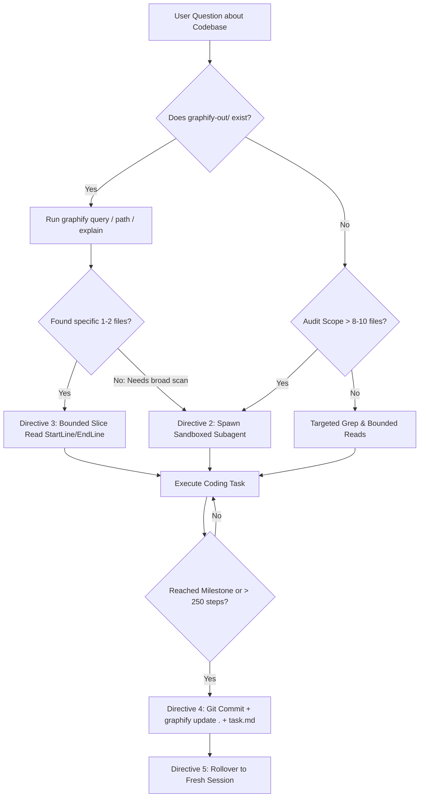

# Integrations & Synergy: The Two-Tier Context Architecture

A common question in agent system design is: **How do these conversation optimization directives work alongside external indexing tools like [Graphify](https://github.com/safishamsi/graphify), GraphRAG, or AST code indexers?**

The short answer: **They solve two complementary halves of the context problem.**

---

## The Two-Tier Context Architecture

When building or working on complex codebases, context management requires two distinct layers:

```
┌──────────────────────────────────────────────────────────────────────────┐
│                     Two-Tier Agent Context Architecture                  │
└──────────────────────────────────────────────────────────────────────────┘

     TIER 1: Topological Knowledge (Static / Persistent)
     ┌────────────────────────────────────────────────────────────────┐
     │  Tool: Graphify / GraphRAG / AST Indexes                       │
     │  Role: Maps the codebase topology (god nodes, community edges) │
     │  Storage: graphify-out/graph.json, graphify-out/wiki/          │
     │  Goal: Prevent broad grepping by pre-computing relationships   │
     └───────────────────────────────┬────────────────────────────────┘
                                     │
                     Scoped Subgraphs & Node Answers
                                     │
                                     ▼
     TIER 2: Working Conversation Memory (Dynamic / Operational)
     ┌────────────────────────────────────────────────────────────────┐
     │  Tool: Agent Context Optimization Directives (This Repo)       │
     │  Role: Governs agent behavior during live multi-turn loops     │
     │  Enforcement: Subagent sandboxing, bounded reads, 250-turn     │
     │               milestone rollovers, artifact-first resumes      │
     │  Goal: Prevent compounding conversation bloat & token latency  │
     └────────────────────────────────────────────────────────────────┘
```

| Layer | Focus | Key Challenge Solved | Primary Artifacts |
| :--- | :--- | :--- | :--- |
| **Tier 1: Knowledge Indexing** *(e.g., Graphify)* | **Codebase Structure** | "Where is the logic located, and how do files connect across the codebase?" | `graphify-out/graph.json`, `GRAPH_REPORT.md`, `wiki/index.md` |
| **Tier 2: Conversation Governance** *(Directives)* | **Agent Operational Memory** | "How do we prevent 50-turn conversations from compounding latency, hallucinating diffs, and overflowing context?" | `task.md`, `walkthrough.md`, `git commits` |

---

## How They Harmonize in Practice

### 1. Graphify Drastically Lowers Search Scope (Synergy with Directive 2)
- **Without Graphify**: To investigate an unfamiliar architectural question (e.g. "How is auth verified on WebSocket streams?"), an agent might scan 15+ files. Under Directive 2, it would be forced to spawn a subagent to sandbox those reads.
- **With Graphify + Directives**: The agent runs `graphify query "How is auth verified on WebSocket streams?"`. Graphify traverses its graph and returns a **20-line targeted answer** citing specific node locations.
- **Outcome**: The agent never has to scan 15 files or spawn a subagent for a routine question. The knowledge graph resolved the answer in < 500 tokens!

---

### 2. Directives Protect Against "Graph Dumping" (Synergy with Directive 3)
- Graph databases (`graphify-out/graph.json`) can easily grow to several megabytes (100,000+ tokens of raw JSON).
- If an agent erroneously calls `view_file` on `graphify-out/graph.json` or dumps an un-sliced 1,000-line `GRAPH_REPORT.md` into the prompt, it completely saturates the conversation window.
- **Directive 3 Explicitly Prohibits This**: The directives mandate using the CLI/MCP traversal tools (`graphify query`, `graphify path`, `graphify explain`) or navigating the wiki rather than dumping the raw graph file into conversation memory.

---

### 3. Subagents Sandbox Heavy Graph Builds (Synergy with Directive 2)
- When initializing Graphify on an unindexed codebase (`/graphify .`), the extraction process inspects files across the entire repository.
- Under Directive 2, executing broad extraction or semantic subagent passes is isolated into child execution scopes.
- The parent conversation remains completely clean and unaffected by intermediate extraction chunks.

---

### 4. Milestone Checkpointing Keeps Persistent Knowledge in Sync (Synergy with Directive 4)
- At milestone checkpoints (~250 turns or major feature completion):
  1. Working code is committed to `git`.
  2. The knowledge graph is kept fresh: the agent runs `graphify update .` (an AST-only update with zero LLM token cost).
  3. Status is recorded in `task.md` and `walkthrough.md`.
  4. The session is rolled over to a fresh conversation.
- When the fresh conversation starts, it inherits both **clean token history** and an **up-to-date knowledge graph**.

---

## The Coexistence Matrix



---

## Summary Checklist for Developers Using Graphify

1. **Always query before grepping**: If `graphify-out/` is present, prefer `graphify query "<topic>"` over wide `grep_search`.
2. **Never raw-cat graph artifacts**: Let Graphify format the response. Never dump `graph.json` directly into your prompt.
3. **Keep graphs updated at checkpoints**: Add `graphify update .` to your milestone commit routine.
4. **Clean resets**: When a conversation hits 250 steps, don't fear restarting. Your code is in Git, your task list is in `task.md`, and your architecture is preserved in `graphify-out/`.
